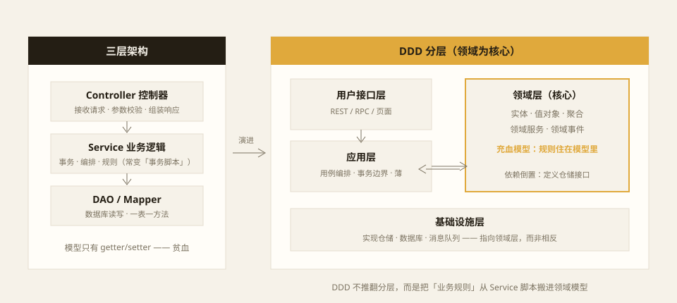
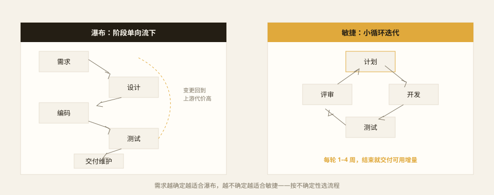

面试、文档、技术博客里，这些词总是成串出现，好像必须全用上才算专业。其实它们回答的是三个不同的问题，混着聊只会越聊越乱：

- **代码怎么组织**——这是架构问题：三层架构、DDD；
- **先写什么才算对**——这是质量问题：TDD 先写测试，SDD 先写规格；
- **时间怎么安排**——这是流程问题：瀑布、敏捷。

分开看，每一件事都不复杂。下面按这三组对照讲。

## 三层架构：一次请求的旅程

三层架构是后端最常见的形式，尤其在 Spring、go-zero 这类框架里几乎是默认写法：

```text
HTTP 请求
  → Controller   接收请求、参数校验、组装响应
  → Service      业务逻辑、事务、编排
  → DAO/Mapper   数据库读写
  → 数据库
```

它的核心思想是**关注点分离**：接口协议、业务规则、存储细节各自独立，改数据库不影响接口，改接口不动存储；三层还可以由不同的人并行开发。

但三层用久了几乎必然出现两个症状。一是**胖 Controller**：图省事把业务规则直接写在接口层，换一个入口（定时任务、消息消费）就得复制一遍。二是**贫血模型**：实体类只剩 getter/setter，所有规则都堆在 Service 里长成几百行的「事务脚本」，Service 之间互相调用，最后织成谁也不敢动的毛线球。

问题不在分层本身，而在于分层只规定了「代码放在哪一层」，没规定「业务规则长什么样」。

## DDD：把业务规则放回模型里

DDD（领域驱动设计）给出的答案是：**让业务规则住在领域模型里，而不是 Service 的脚本里**。



DDD 分两个层面。**战略设计**处理大图景：把系统按业务切成若干**限界上下文**（比如电商里的订单、库存、支付各自是一个上下文），每个上下文内部维护一套**通用语言**——产品、开发、代码说的是同一套词，订单状态在哪个上下文里叫什么、什么时候变更，有且只有一种解释。**战术设计**处理单个上下文内部：实体（有身份、有生命周期）、值对象（无身份、不可变，比如金额）、**聚合**（一致性的边界，外部只能通过聚合根修改内部）、领域事件、仓储接口。

它和三层的关系经常被误解：**DDD 不推翻分层**，接口层、业务层、持久层依然存在（领域驱动架构里叫用户接口层、应用层、领域层、基础设施层）。它替换的是分层的「心脏」——Service 从「写满规则的脚本」瘦成薄薄一层用例编排，真正的规则下沉到充血的领域模型里；基础设施数据库反过来依赖领域层定义的接口（依赖倒置），业务模型不再被表结构牵着走。

代价也要说清楚：DDD 的概念多、上手成本高，对团队的业务理解要求深。**业务简单到就是一张表的 CRUD 时，用三层就够了**——为增删改查上聚合根和值对象，是用大炮打蚊子。业务规则多、生命周期复杂、多个团队共用一套模型时，DDD 的投入才开始回本。

## TDD 与 SDD：先写「什么算对」

TDD（测试驱动开发）的循环只有三步：**红——绿——重构**。先写一个会失败的测试（红），用最少的代码让它通过（绿），再在测试保护下整理实现（重构）。它真正的价值不在「测试覆盖率高」，而在**设计反馈**：一个难以编写的测试，往往说明被测接口的职责不清；测试就是第一份「使用说明书」，逼着你在写实现之前先想清楚调用方式。

SDD（规格驱动开发）可以理解为同一哲学在更高层级的版本：**先写规格（spec），再写实现**。规格是唯一真相源，写清这个功能的行为、边界、验收标准，实现和测试都从规格派生。这件事以前一直存在（设计文档、接口约定都是规格的形态），但近几年被 AI 编程重新点燃——给 AI 一份写得足够清楚的规格，它能把实现和测试一起生成出来，规格的质量直接决定产出的质量。

两者的关系一句话说清：**TDD 把「先定义期望」下沉到代码层，SDD 把它上浮到规格层**。它们不冲突，实践里常常是规格先行、测试跟进。

## 瀑布与敏捷：不确定性决定流程



瀑布把项目切成顺序阶段：需求 → 设计 → 编码 → 测试 → 交付维护，每个阶段产出文档，评审通过才进下一阶段。它的假设是**需求可以被一次性想清楚**——这在需求稳定、变更代价极高的领域（航天、医疗、大型乙方交付）依然是合理甚至必要的。但在需求多变的互联网产品里，它的短板致命：市场半年一变，而你要到测试阶段才第一次见到能跑的系统，此时回到上游改需求的代价已经翻了好几倍。

敏捷反过来承认「一开始想不清楚」，用 1–4 周的小迭代循环推进：计划 → 开发 → 测试 → 评审，每轮结束交付一段可用的增量，靠真实反馈修正方向。Scrum 的每日站会、迭代评审、回顾会，看板的可视化流动，都是围绕这个循环展开的仪式。

选哪个，取决于**需求的不确定性**：合同里写死验收标准的项目，瀑布更稳；产品形态还在摸索的团队，瀑布会把你锁死在第一版错误的假设上。

## 它们怎么组合

这些方法论从不互斥，真实项目里是按层拼装的：

- 最常见的组合是**三层 + TDD + 敏捷**：代码按层组织，功能靠测试保护，节奏按迭代推进；
- 业务复杂到 Service 毛线球解不开时，把「心脏」换成 **DDD**，分层结构可以平滑演进过去；
- 引入 AI 编程后，**SDD** 常被加在最前面：规格写得够清楚，生成出来的实现和测试才有质量下限。

回到开头的问题：架构决定代码住在哪里，TDD 和 SDD 决定先写什么，瀑布和敏捷决定时间怎么流。想清楚眼前的问题是哪一个，再从对应的工具箱里拿工具——比背下所有名词有用得多。
