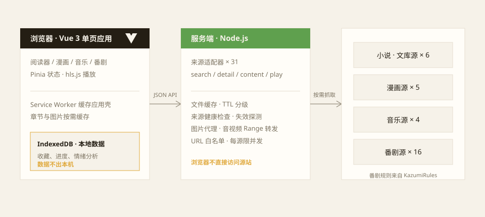
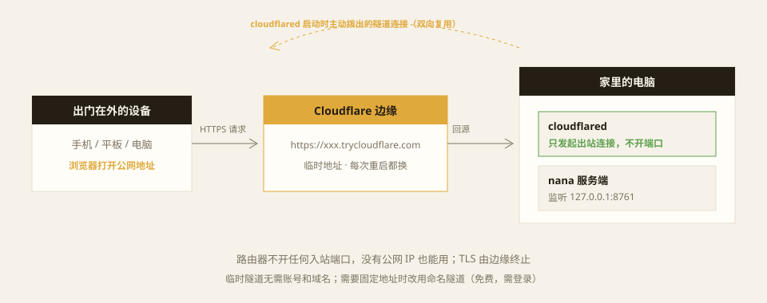

我平时消费的内容大概分四类：小说、漫画、音乐、番剧。它们各有各的 App、各有各的账号，收藏散在四处，进度互不相通，换一台设备就要挨个登录找回。更别提有些站点打开就是满屏广告和登录墙。

所以自己写了一个东西叫 **[nana](https://github.com/222twotwotwo/nana)**——名字来自那部同名漫画。它把四类内容放进同一个主页，共用一套搜索、详情与收藏体验；所有书库、进度、设置都存在自己浏览器的 IndexedDB 里，没有账号体系，也不依赖任何云端服务。这篇文章记录它的架构和一些实现上的取舍。

## 架构：一个浏览器端、一个本地服务端、31 个来源



整个项目就两层。前端是 Vue 3 加 Pinia 的单页应用（TypeScript + Vite 构建），负责阅读器、漫画翻页、音乐播放器和番剧播放（m3u8 用 hls.js）；服务端是纯 Node.js 写的，连 Express 都没用，入口加全部业务只有一千五百行左右。

最关键的一个决定是：**浏览器永远不直接访问来源站点**。所有搜索、目录、章节、图片、音视频请求都由本地服务端统一代理。这个决定带出一串好处：

- 缓存、编码转换、防盗链 Referer 这些脏活只做一次，前端不用关心源站长什么样；
- 浏览器侧没有任何跨域问题，来源站也看不到用户的浏览器指纹；
- 换源、重试、失败回退可以在服务端统一做，前端只拿到干净的结果。

数据这一侧，前端用 IndexedDB 存了三个仓：`books`（书库与章节）、`music`（歌单）、`analyses`（情绪分析结果）。没有服务端用户数据这回事，收藏记录永不离开本机。

## 三十多个来源是怎么接进来的

目前内置 31 个来源：小说 6 个（酷我小说、笔趣阁、维基文库、轻小说文库等）、漫画 5 个（漫画人、快看、WEBTOON、MangaDex 等）、音乐 4 个（网易云、Internet Archive 等）、番剧 16 个。每个来源是一个适配器，实现统一约定的四个动作：

```js
// 所有来源共用同一套动作接口
const data = await service.action(source, action, value)
// action: 'search' | 'detail' | 'content' | 'play'
// 小说与漫画返回 text / images，音乐与番剧返回 stream
```

HTML 解析用 cheerio，遇到渲染才出内容的站上 jsdom；老站常见的 GBK 编码交给 iconv-lite。搜一次并行查当前分类的全部来源，结果按匹配程度排序，单个来源挂了不影响其他结果。

番剧的 16 个源没有一个个手写——[KazumiRules](https://github.com/Predidit/KazumiRules) 维护了一套公开的规则索引，nana 直接接入它全部 16 个源。过程还挺有意思：我把 Kazumi 的 Kotlin 插件源码翻了个遍，把它的规则解析、请求构造和视频源解析逻辑对回 JavaScript 实现。项目里留了个 `.research` 目录，存着几十份对每个源站的探测记录——请求样本、解码后的响应、直连与代理的对比，接一个源就是一次小型逆向。

除了内置来源，应用还支持**导入自定义源规则**（上限 100 个），规则带版本号，改动后健康检查会自动重新探测。

## 服务端替浏览器干的重活

代理层看着只是转发，实际上干了不少事。

**缓存**：所有结果按 `来源:版本:动作:参数` 拼出 key，用 SHA-256 哈希成文件名落盘。TTL 分级——搜索结果 5 分钟、详情目录 1 小时、章节正文 30 天；同一个 key 的并发请求会共享同一个 Promise，避免重复抓取打挂源站。缓存目录做了修剪：最多 2000 个文件、100MB、30 天过期，超了就从最旧开始删。

**健康检查**：来源站是活的，域名会换、接口会改。服务端给每个来源准备了一个探针（样本关键词 + 指定的验证作品），做一次完整的「搜索 → 详情 → 正文/播放」链路测试，把耗时、章节数、样本章节都记进 `health.json`。前端据此把来源标成健康、过期或失效，坏掉的来源一眼可见。

**媒体转发**：漫画图片走服务端代理时做 magic-byte 嗅探，防止源站返回一个错误页却被当成图片；音频和视频支持 Range 请求转发，番剧播放地址通过一次性 ticket 换取，不做常驻直链。

**约束**：每个来源并发上限 3，请求体限 8KB，所有出站 URL 走白名单校验（防止某个适配器被构造出恶意参数后把请求打去别的地方），POST 请求校验 Origin。这些都是被「接了 31 个不归我控制的站」这个前提逼出来的习惯。

## 数据全在本地，AI 是可选项

nana 里最花心思的功能是**情境配乐**：给小说章节绑定一个情绪标签的音乐播放列表，读到哪里自动切氛围。

配乐的情绪从哪来？两个来源：手动标记，或者 AI 分析。AI 这条路是可选的——在设置里填自己拥有的 OpenAI 兼容接口地址和密钥，模型会对章节文本做情绪走向分析，输出一串带位置的情绪节点（比如 0% 平静、40% 紧张、85% 释然），存进 IndexedDB 后驱动播放列表切换。**不填接口也完全不影响阅读和听歌**，分析纯粹是锦上添花；接口密钥只存本地设置，备份文件导出时也会把它剥掉。

换浏览器或换设备时，书库、进度、歌单、分析结果可以一键导出成备份文件，到新机器上一键恢复。

## 断网也能用

应用壳本身用 Service Worker 缓存，首次在线打开之后，断网也能进界面。小说章节和漫画图片按阅读需要缓存到本地——看过一遍的内容，之后地铁里没信号也能接着读。番剧和音乐没法真离线（流媒体本性如此），但播放失败时会**自动换源**：同一集去其他来源找对应集数接着播，进度和收藏都保留，也可以手动指定来源。

## 出门在外：Cloudflare 临时隧道

「数据全在本地」有个隐含的代价：换一台设备，IndexedDB 里的书库不会跟过去。我的办法是让家里的电脑一直开着 nana，问题只剩下——怎么从外面访问一个监听在 `127.0.0.1:8761` 的服务。

经典方案都不太顺手：局域网地址出了门就失效；公网 IP 加端口转发要动路由器，还把家庭网络暴露在公网上；各类内网穿透工具要么要注册账号，要么限速。

我的选择是 Cloudflare 的**临时隧道**（quick tunnel），一条命令：

```bash
cloudflared tunnel --url http://127.0.0.1:8761
# 输出里会有一行随机地址：
# https://some-random-words.trycloudflare.com
```

不需要 Cloudflare 账号，也不需要自己的域名。原理是：cloudflared 启动时主动向 Cloudflare 边缘拨出一条**出站**连接，之后所有访问 `xxx.trycloudflare.com` 的请求都从边缘沿着这条连接回到家里，再转给本机的 nana——路由器零配置，TLS 由边缘自动终止。



它好在哪里：

- 不开任何入站端口，没有公网 IP 也能用，家庭网络不暴露；
- 手机浏览器访问的是一个正经的 https 地址，不用对付自签证书；
- 临时地址每次重启都换，天然是一个「阅后即焚」的能力 URL——猜不出来，也不值得被长期扫描。

代价也要说清楚。临时地址不设防：**拿到链接的任何人都能用你的 nana**，所以只适合个人使用，链接别外传；需要固定地址或访问控制时，升级成命名隧道（同样免费，但要登录账号、绑定域名），再套一层 Cloudflare Access 做身份验证。

隧道对应用本身的影响也真实存在：每个请求都要绕道 Cloudflare 边缘，主页一次预取十几次详情的延迟肉眼可见——nana 后来改成「轻量入库 + 打开时才补全目录」的两阶段加载，一半原因就在这。反过来，服务端那份分级缓存在隧道下更值钱了：章节正文缓存 30 天，第二次阅读根本不会重新回源。还有个细节值得记一笔：服务端的跨站 POST 校验比对的是 Origin 和请求自身的 Host，所以换成 trycloudflare.com 域名访问时，同源请求照常放行，站外构造的 POST 依旧会被 403 拦下——隧道没有削弱这层保护。

## 使用范围

最后是必要的一句话说明：nana 按个人使用目的接入公开可读取的内容，不解锁付费章节，也不绕过登录或人机验证；来源站点的可用性取决于它们自身的状态，会员或受限内容请去原站处理。公开商业运营需要另行获得内容授权。

项目还在持续打磨（服务端 v3.0、前端 v4.0），完整源码在 [222twotwotwo/nana](https://github.com/222twotwotwo/nana)，下一步想把来源健康检查做成定时任务，以及给漫画阅读加预加载。这类项目最大的乐趣不在写界面，而在跟 31 个性格迥异的源站打交道——每个站都教你一点 HTTP 的真实世界。
