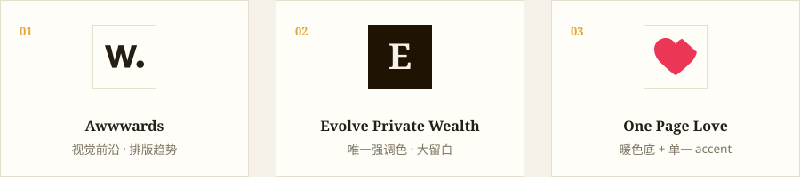
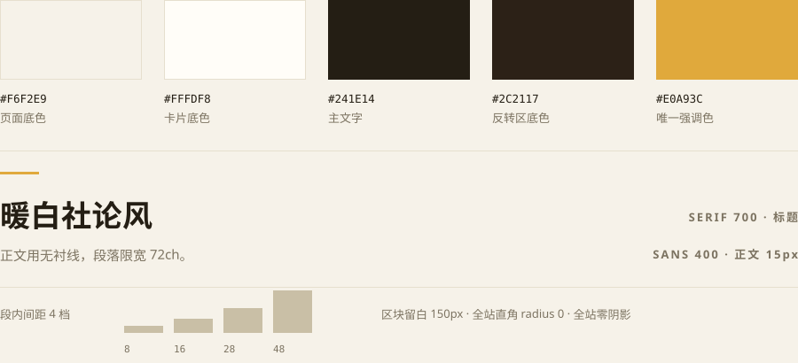
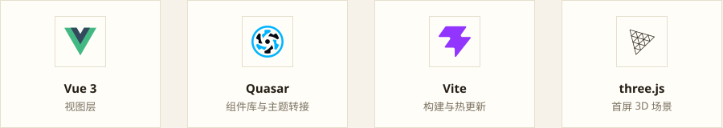

我大概试过十几次让 AI「直接设计一个页面」。结果都很像：能用，但很平。

平在哪儿？不是配色难看，也不是排版出错。是它给出的每一个选择都太安全了：蓝紫渐变、圆角 12px 的卡片、居中的大标题、均匀的柔和阴影。这些元素单独拿出来都没毛病，组合在一起就是「平均值」——看起来像 1000 个网站的平均数，因为它确实就是。

后来我换了个思路：不再让 AI 去发明风格，而是先给它一个明确的靶子。让它去抓知名设计站的子页面截图，把视觉风格按维度拆开，产出一份可复用的设计文档；然后开一个新会话，把这份文档连同当前页面一起交出去，让它照着改。

这篇文章记录的就是这套流程，以及它最后产出的那套风格——我给这版界面起的名字叫「暖白社论风」。

## 问题不在模型，在「没有约束」

让模型凭空做设计，它只能回到共识。而设计感恰恰来自取舍。

举几个我这版界面里真实用到的取舍：

- 全站只用两个色相：暖白系和深棕系，再加一个高饱和金黄做强调。
- 全站直角，`border-radius: 0`。
- 全站零阴影，交互反馈只靠描边变深和位移。
- 区块上下留白 150px，但段内间距只允许 4 档。

这些约束没有一条是模型会主动给自己的。它的默认行为是「尽量都满足」——你想要层次，它就加阴影；你想要重点，它就加颜色；你想要柔和，它就加圆角。什么都来一点，最后就是平均值。

所以真正要解决的不是「怎么让 AI 更会设计」，而是两件事：**先拿到一套明确的约束，再让它严格执行这套约束**。而约束从哪来？从真实设计师做出来的页面里抄。

## 参考站要挑互补的，不是挑好看的

我挑了三个站，不是因为它们都好看，而是因为它们覆盖了三种不同的取向：



- **Awwwards**：取它「靠字重和字号拉层级」的做法。它很少用颜色区分信息层级，而是把字重、字号、行距拉开差距。
- **Evolve Private Wealth**：取它「唯一强调色 + 极大留白」的克制感，以及「左侧小标签 / 右侧大段内容」的社论式两栏结构。
- **One Page Love**：取它「暖米色底 + 单一高饱和 accent」的配色组合，以及低密度单列排版。

三种取向叠在一起，才能做加减法。只抄 Awwwards，容易做成一个排版很用力但颜色很吵的页面；只抄 One Page Love，会得到「很干净但偏薄」的结果。三个一起看，才能判断哪些是该抄的、哪些是该丢的。

这一点后来被我写进了设计文档里，作为风格来源的溯源记录。

## 抓的是「关键部分」，不是整页

这一步是最容易被做错的地方。

如果直接把整页截图丢给模型，它通常只会回你一句「风格简洁现代，配色协调」——因为整页的信息密度太高，它抓不到可执行的细节。

所以抓取时要做两件事：

- **进子链接，而不是只看首页**。首页是展示橱窗，子页面才是真正的排版系统在跑的地方。
- **只截关键部分**：导航栏、首屏、卡片网格、表格、按钮组、页脚。每一张截图对应一个具体的组件问题。

局部截图才能对齐真正需要落地的东西：圆角是多少、边框有没有、间距多大、表头是米色还是冷灰、按钮 hover 时是变深还是加阴影。

## 把它固定成一个提示词

截图准备好之后，我用的还是一条结构很死板的提示词，五个维度一条都不许漏：

```text
我需要对当前业务的整体 UI 设计做一次风格迭代，我会给你几张参考设计的截图
请你仔细分析它的视觉风格，然后把这种风格应用到我当前的页面上
请重点还原这几个方面：
1. 配色：主色、辅助色、背景色、文字颜色
2. 字体：标题和正文的字号层级、粗细、对比
3. 间距与留白：模块之间、元素之间的呼吸感
4. 组件样式：按钮、卡片、导航栏的圆角、阴影、边框
5. 整体布局：参考它的排版结构来组织页面
```

这五条里，每一条都在逼它把「感觉」翻译成「数值」：

- **配色**要求它区分主色、辅助色、背景色、文字色。这个强制的区分会暴露一个关键事实：好的参考站里，辅助色往往根本不存在，真正被反复使用的只有一个强调色。
- **字体**要求它写出字号层级。这一步最容易发现模型默认不做的事——它习惯用颜色区分层级，而参考站用的是字重和字号。
- **间距与留白**要求它把「呼吸感」写成具体数字，只有变成数字才能写进 CSS。
- **组件样式**要求它明确回答圆角、阴影、边框三个问题。我后来在这条上加了硬要求：先在有圆角/无圆角之间做一次排他选择。因为参考站主流是圆角和胶囊，而我最后选了直角——那么阴影就必须跟着一起放弃，否则会出现「直角 + 投影」的混合感，哪种语言都不彻底。
- **整体布局**要求它照参考站的排版结构来组织页面，而不是只换皮肤。

但这条提示词还差最后一句，也是最重要的一句：**把以上分析写成一份设计文档，而不是直接改页面**。

## 产出：一份可以复用的设计文档

很多次失败让我确认了一件事：直接让它改页面，改完就没了。正确做法是先要文档，再动代码。

这份文档的目标写得非常明确——任何人（包括 AI）读完文档、打开 `src/style.css`，就能把这套风格完整复现到别的页面上。它不叫「风格小结」，它是一份复现手册。



文档里有十二个章节：复现速查、设计依据、Design Tokens、字体层级表、间距与网格、三个可复用的排版范式、组件规格、断点与降级、框架适配坑、实现约定、从零复现步骤、验收清单。

几个真实落地下来的决定：

- **配色只有两个色相**：暖白（`#F6F2E9` 页面底 / `#FFFDF8` 卡片底）+ 深棕（`#241E14` 主文字 / `#2C2117` 反转区底），再加**唯一一个**高饱和金黄 `#E0A93C`。
- **层级靠字重 + 字号 + 明暗，不靠颜色**。正文只有两级文字色，用 `--text` 和 `--dim` 两个变量管住。
- **中文标题用衬线，中文正文用无衬线**。形成「小号宽字距大写英文标签 ↔ 大号衬线中文标题」的强反差。中文标题的字距从过去的 4–12px 收窄到 0.5–2px，宽字距只留给英文小标签。
- **区块留白 150px，段内间距只保留 8 / 16 / 28 / 48 四档**。不允许出现 12px、22px、35px 这类随手值。
- **深色反转区切分节奏**。页面不是一路浅底，而是「深 → 浅 → 深」，用背景图加一层 `rgba(44,33,23,.84)` 的遮罩做出质感。

其中我最满意的一条是给唯一强调色定的使用红线：`--sun` 只允许出现在七类语义用途里——主按钮底色、强调线上的数字、标题下的短横线、当前态圆点、进度条填充、链接 hover 下划线、区块编号。**任何大面积填充都不许用它**。因为一旦把它铺开，唯一性就被稀释了，整套配色会跟着塌掉。

## 落地后的页面长什么样

风格定下来之后，页面结构也跟着变清晰了。这一版是给一个暑期项目做的官网，最后成型的结构大概是这样：

- **首屏**：大号衬线主标题（`clamp(56px, 10vw, 108px)`，字重 900）+ 一行宽字距英文副标 + 一行 slogan，下方是一条用细竖线分隔的数据栏。
- **网站模块**：三列网格，`gap: 40px 20px`——行距刻意大于列距，让每张卡都有自己的标题区呼吸。
- **活动目标**：两列，每条前面用燕尾形的深棕序号徽章。
- **考核区**：`1.25fr / 1fr` 的不对称两栏。
- **S 形流程**：四张卡用绝对定位排成蛇形，中间用 SVG 连线串起来。
- **产品秀**：一个吸顶劫持的横向滚动区，进度用圆点表示，当前态圆点换成金黄。
- **深色陈述区 + Join 区**：整块深棕底，用来把页面切成三段节奏。

导航是固定高度 68px 的透明条，滚动超过 40px 之后才浮出底色和一根 1px 下边框；当前项用 `inset 0 -2px 0 var(--sun)` 做金色下划线。表格表头用米色 `--accent-soft` 而不是冷灰——冷灰会立刻把暖白基调弄脏。

前端这边没有引入任何新依赖，还是原来那套：



所有样式集中在 `src/style.css` 一个文件里，组件内不写 `<style>`。颜色、间距、字体、圆角全部收口到 `:root`，组件里禁止散落魔法值。改视觉只动这一个文件。

## 真正值钱的是「踩过的坑」

设计文档里最有价值的部分，其实不是配色表，而是那些**只有做完才知道**的适配坑。文档里专门留了一节记录它们：

- `q-header` 默认继承 `text-white`。任何放进表头的图标和文字，如果没显式给颜色，在暖白底上就是一片不可见的白色。
- `.q-btn--round` 自带 `2.572em` 的 `min-width` / `min-height`。只写 `width: 38px` 会被压回去，实测渲染成 42px，必须同时写 `min-width` / `min-height`。
- `q-btn` 带 `href` 时渲染成 `<a>`，不带则渲染成 `<button>`。所以给导航项写的选择器对汉堡按钮不生效，别照抄。
- 入场动画用的是 IntersectionObserver（threshold 0.12）。无头浏览器里程序化滚动不触发回调，截图会整片空白，审查时必须额外注入一段脚本强制元素可见。
- 产品秀的响应式降级是**三处联动**——滚动轨道、容器、内层容器都要一起回到文档流，少改一处整页重叠。

这些不是设计原则，是施工记录。设计文档如果不写这一节，下一次还得从头再踩一遍。

## 把设计规范存进项目：`assets/design/`

文档产出来了，但如果它只留在某个会话里、或者躺在原项目目录下，下一次要用还是得靠回忆去找。所以我在博客仓库里专门划出一块地方放这些设计文档：

```text
assets/design/
├── warm-editorial-spec-2026-09-21.md      ← 规范本体（原 design.md）
├── warm-editorial-analysis-2026-09-20.md  ← 三个参考站的逐项拆解
├── warm-editorial-prompt-2026-09-20.md    ← 通用版 + 项目专用版提示词
├── warm-editorial-refs-2026-09-20.md      ← 参考包子链接与截图索引
└── index.json                             ← 自动生成的清单
```

命名规则是 `<风格代号>-<文档类型>-<YYYY-MM-DD>.md`，三段都有明确分工：

- **风格代号**（`warm-editorial`）让同一套风格的文档在排序时天然聚在一起，将来并存第二套风格也不会混。
- **文档类型**（`spec` / `analysis` / `prompt` / `refs`）对应流程的四个阶段：规范本体、参考站拆解、提示词包、参考包索引。四份缺一份，下次就得重新推一遍。
- **日期后缀**是最关键的一段。同一套风格一定会迭代，而第二版不该覆盖第一版：以后出现 `warm-editorial-spec-2027-03-14.md` 时，它和现在这份可以并存——出问题能回退对照，也能一眼看出这套风格是哪天定下来的。

`index.json` 不需要手写，它是构建脚本顺手扫出来的：扫 `assets/design/` 下的 `.md`，从文件名解析风格代号和日期，取第一个一级标题当标题、第一段引用当摘要。加一份文档只要两步——按命名规则丢进目录，跑一次构建：

```text
Generated content-index.json with 14 posts.
Generated assets\design\index.json with 4 design docs.
```

这一步对下一次接手的会话特别重要：它不需要翻遍仓库猜哪份文档是最新的，读一眼清单就知道。

这里有一个刻意的取舍：**这块空间和文章是两条线**。`assets/paper/` 是给人读的文章，会进文章列表、带日期和标签；`assets/design/` 是给人和 AI 复用的规范资产，不出现在列表里，也不参与站点渲染。参考站的 PNG 截图同样没有一起归档——体积大，而且是第三方站点的素材，留在本地参考包里就够了；文档里已经把需要的信息全部转成了可执行的数值，截图反而没那么必要。

## 最后一步：开一个新会话

文档写完，工作其实只完成了一半。剩下的关键动作是：**开一个新会话，把任务交接出去**。

为什么必须新开一个？因为做过风格讨论的那个会话里，已经堆满了被否掉的方案、试过的版式和来回调整的记录。继续用它，它会一直试图「协调」之前的决定，而不是干净地执行一份已经定稿的规范。

新会话只带两样东西：归档好的设计规范，和当前需要改造的页面。启动话术也很短：

```text
先读 assets/design/index.json，打开日期最新的那份 spec。
把它当作这次改版的唯一视觉规范，不要重新讨论风格，
也不要在规范之外引入新的色值、依赖或组件。
改完对照文档最后一节的验收清单逐条自查。
```

## 验收清单才是这套文档的灵魂

`design.md` 的最后一节是一张 checkbox 清单。它长这样：

- `:root` 之外的 CSS 里没有硬编码色值
- 全站 `border-radius` 只有 `0`，外加 `50%`（只有两个圆形圆点）
- 除 inset 下划线与 `none` 外，没有任何 `box-shadow`
- 中文字距 ≤ 2px，宽字距只出现在英文小标签上
- 正文段落都有 `max-width: 72ch`
- 衬线只用于标题和数字，正文是无衬线
- 金色 `--sun` 只落在约定的七类用途内
- 至少有一个深棕反转区，页面有明暗节奏
- 三档断点都过一遍，产品秀与流程图降级正常
- `npm run build` 零报错

这张清单是整份文档最重要的部分。因为**规范能不能被真正执行，取决于它能不能被检验**。「保持克制」无法检验，「`grep -n "box-shadow"` 出来只剩 inset 和 none」可以。

## 小结

AI 直出的设计之所以平庸，不是能力问题，是它没有约束、也没有靶子。给它一堆参考截图和五个必须回答的维度，它就会开始做取舍；再要求它写成文档，这次的结果就能沉淀下来。

这套流程现在被我固定成了六步：**挑互补的参考站 → 抓子页面的关键局部截图 → 按五个维度拆解 → 产出一份带验收清单的设计文档 → 按「风格代号-文档类型-日期」归档进 `assets/design/` → 开新会话执行并逐条自查**。

走了这一遍之后，真正的产出其实不是那个页面，而是那份规范。换业务、换项目，`warm-editorial-spec-2026-09-21.md` 可以继续拿来用；想换风格，就重跑一遍参考站流程，再产一份带新日期的新文档。设计从一次性的生成，变成了可以积累的资产。

## 参考

- [Awwwards](https://www.awwwards.com/) —— 视觉前沿与排版趋势
- [Evolve Private Wealth](https://evolveprivatewealth.com/) —— 唯一强调色与大留白
- [One Page Love](https://onepagelove.com/) —— 暖色底与单一 accent 的组合

本次风格迭代产出的四份文档已归档在 `assets/design/`，可从 `assets/design/index.json` 查到清单。
